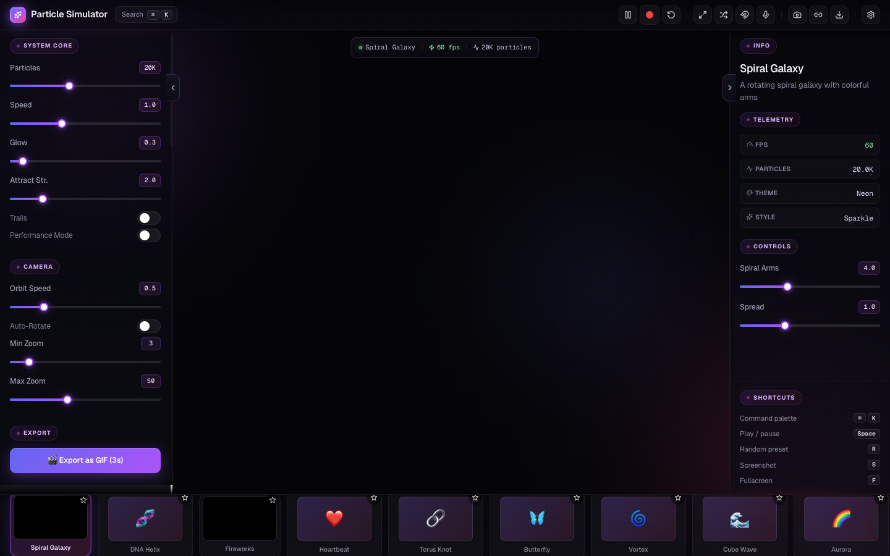
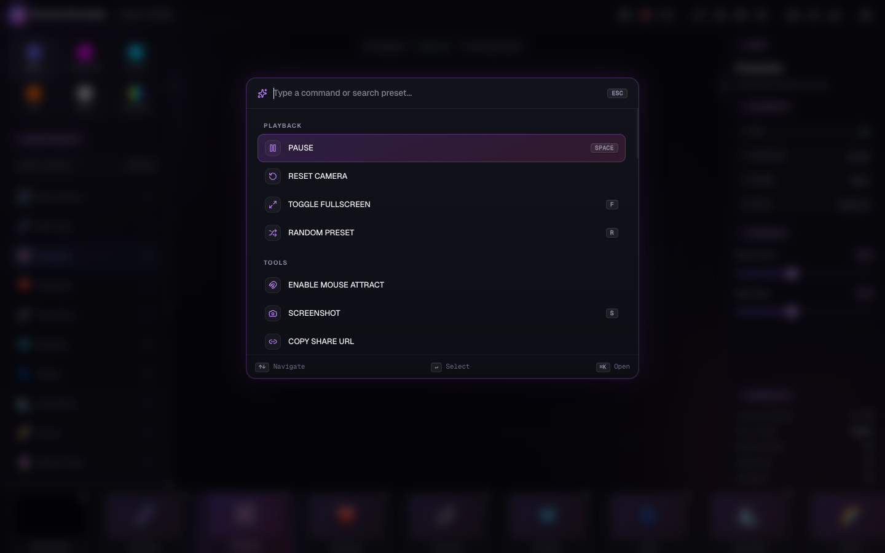
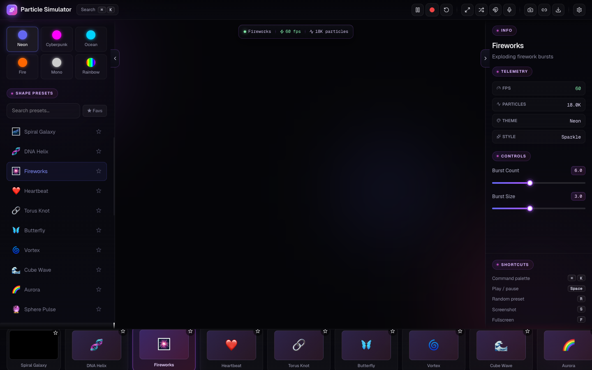

# ✦ AI Particle Simulator

[](https://sanjays2402.github.io/ai-particle-simulator)
[](LICENSE)
[](https://react.dev)
[](https://threejs.org)

A real-time 3D particle system generator powered by AI. Describe what you want, and watch 20,000+ particles come to life — wrapped in a premium command-palette driven UI.



## ✨ Features

- **🎨 25+ Built-in Presets** — Galaxy, DNA, Fireworks, Heart, Butterfly, Vortex, Aurora, Black Hole, Solar Flare, Quantum Tunnel, and more
- **🤖 AI Text-to-Particles** — Describe any effect and AI generates the simulation code
- **🎛️ Dynamic Controls** — AI-generated sliders for real-time parameter tweaking
- **✨ Visual Styles** — Sparkle, Plasma, Blob, Ring particle rendering modes
- **🎨 6 Color Themes** — Neon, Cyberpunk, Ocean, Fire, Mono, Rainbow
- **⌘K Command Palette** — Fuzzy-search every preset, action, and shortcut
- **📊 Live Telemetry** — FPS, particle count, theme, and style in the right panel
- **🖱️ Mouse Interaction** — Particles react to cursor movement + parallax orbs
- **🎵 Sound Reactivity** — Particles respond to audio input
- **📸 Screenshots** — Capture your creations with one click
- **🎬 GIF Export** — Record 3-second animated GIFs
- **📥 Export** — Download as standalone HTML or React component code
- **⚡ 60fps Performance** — Optimized for 20K+ particles with zero garbage collection

## Screenshots

### Main interface


### ⌘K Command Palette


### Theme palette with live preview


## 🚀 Getting Started

```bash
# Clone the repo
git clone https://github.com/Sanjays2402/ai-particle-simulator.git
cd ai-particle-simulator

# Install dependencies
npm install

# Start dev server
npm run dev
```

Open [http://localhost:5173](http://localhost:5173) to see it in action.

## ⌨️ Keyboard Shortcuts

| Key | Action |
|-----|--------|
| `Space` | Play / Pause simulation |
| `R` | Reset to default view |
| `S` | Take screenshot |
| `1-9` | Switch between presets |
| `T` | Toggle trail effect |
| `M` | Toggle mouse interaction |
| `F` | Toggle fullscreen |

## 🤖 AI Integration

To use the AI text-to-particle feature:

1. Click the ⚙ Settings icon
2. Enter your OpenAI-compatible API key and base URL
3. Type a description in the Smart Text Engine
4. Hit **✦ Generate**

Works with any OpenAI-compatible API (OpenAI, Anthropic via proxy, local models, etc.)

### Example Prompts

- *"A spiral galaxy with blue and purple stars orbiting a bright center"*
- *"DNA double helix rotating slowly with glowing green nucleotides"*
- *"Rain falling through fog with splashes on an invisible surface"*
- *"Fireflies in a forest at night, flickering randomly"*

## 🛠️ Tech Stack

- **React 18** + **Vite** — Fast dev/build toolchain
- **Three.js** + **React Three Fiber** + **Drei** — 3D rendering
- **Postprocessing** — Bloom, chromatic aberration effects
- **Tailwind CSS** — Styling
- **Zustand** — State management

## 🤝 Contributing

Contributions are welcome! Feel free to open issues or submit PRs.

1. Fork the repo
2. Create your feature branch (`git checkout -b feat/amazing-feature`)
3. Commit your changes (`git commit -m 'Add amazing feature'`)
4. Push to the branch (`git push origin feat/amazing-feature`)
5. Open a Pull Request

## 📄 License

MIT — see [LICENSE](LICENSE) for details.
