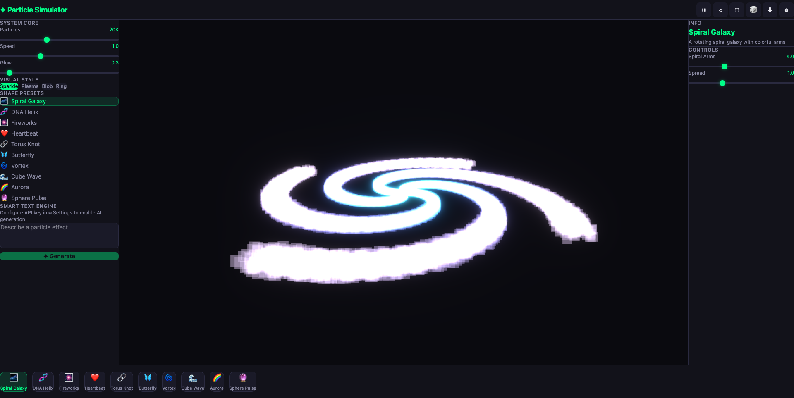
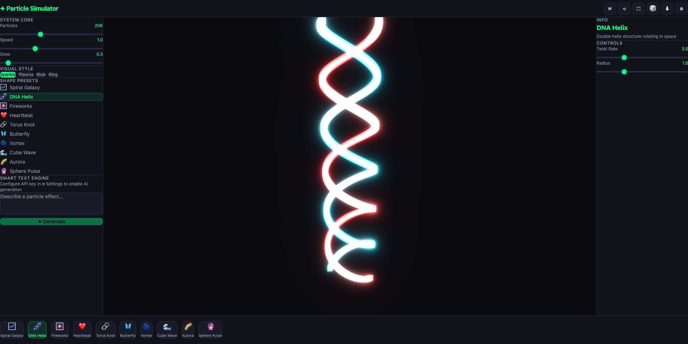
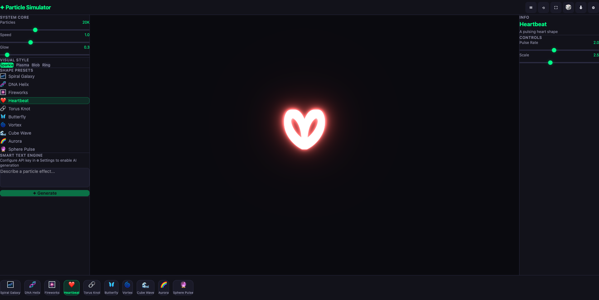

# ✦ AI Particle Simulator

A real-time 3D particle system generator powered by AI. Describe what you want, and watch 20,000+ particles come to life.



## ✨ Features

- **🎨 10 Built-in Presets** — Spiral Galaxy, DNA Helix, Fireworks, Heartbeat, Torus Knot, Butterfly, Vortex, Cube Wave, Aurora, Sphere Pulse
- **🤖 AI Text-to-Particles** — Describe any effect and AI generates the simulation code
- **🎛️ Dynamic Controls** — AI-generated sliders for real-time parameter tweaking
- **✨ Visual Styles** — Sparkle, Plasma, Blob, Ring particle rendering modes
- **📥 Export** — Download as standalone HTML or React component code
- **⚡ 60fps Performance** — Optimized for 20K+ particles with zero garbage collection

## Screenshots

| Spiral Galaxy | DNA Helix | Heartbeat |
|:---:|:---:|:---:|
|  |  |  |

## 🚀 Getting Started

```bash
# Clone the repo
git clone https://github.com/Sanjays2402/ai-particle-simulator.git
cd ai-particle-simulator

# Install dependencies
npm install

# Start dev server
npm run dev
```

## 🤖 AI Integration

To use the AI text-to-particle feature:

1. Click the ⚙ Settings icon
2. Enter your OpenAI-compatible API key and base URL
3. Type a description in the Smart Text Engine
4. Hit **✦ Generate**

Works with any OpenAI-compatible API (OpenAI, Anthropic via proxy, local models, etc.)

## 🛠️ Tech Stack

- **React 18** + **Vite**
- **Three.js** + **React Three Fiber** + **Drei** + **Postprocessing**
- **Tailwind CSS**
- **Zustand** for state management

## 📄 License

MIT
